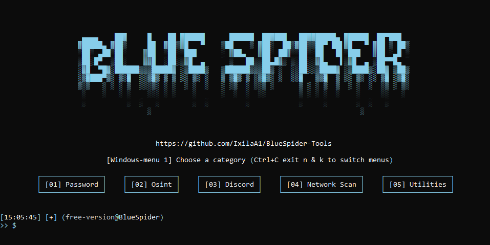

<h1 align="center">Multi-Tools</h1>

  

   <a href="https://guns.lol>GunsLol</a> ・ <a href="[https://discord.gg/example](https://discord.gg/mcR7PCdWWf)">Discord</a>

  
  - Developed in <strong>Python</strong>, by <a href="https://guns.lol/IxilaA1">IxilaA1</a> 
  - Tool in <strong>English</strong>. 
  - Available on <strong>Windows</strong> and <strong>Linux</strong>. 
  - <strong>No malware</strong> or <strong>backdoor</strong>. 
  - <strong>Open Source</strong> only for verification, ensuring no malicious programs. 
  - <strong>Frequently updated</strong>. 
  - <strong>Free</strong> for everyone. 
    

<h1 align="center">Disclaimer</h1>

  
  - BlueSpider Tools has been developed solely for educational purposes. 
  - This project has been created with good intentions and is intended for personal use only. 
  - By choosing to use BlueSpider, you acknowledge and accept full responsibility for any consequences that may result from your actions. 
  - These are <strong>not backdoors or malware</strong>.
  

<h1 align="center">Tools</h1>

<h1 align="center">Requirements</h1>

<h3>Windows:</h3>

- Install <a href="https://www.python.org/downloads/">Python</a> with the <a href="Img/Python_Path.png">PATH</a> options. 
- Windows 10 & 11 or +

<h3>Linux:</h3>

- Latest version of <a href="https://www.python.org/downloads/">Python</a>. 
- Linux recent version.
  

